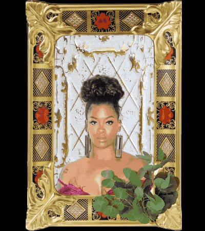

# Black Women Are Fine Art

I had such a therapeutic experience while making this little web app. When prompted with this assignment, create my version of a "Mix & Match" Creator Prototype,  I had a few ideas: create different dirt bikes inspired by my toddler son, something with landscapes or buildings, and hairstyles I love. I decided to go with creating "fine art pieces" with Black women as the center and focus. This project is no different from my others, where I want to interrogate how we, Black women, see ourselves vs. how we are viewed. For this project, I decided to focus on the former and as a result, I created something pretty elegant and meaningful.

#### See it in action!
You can view my application by [clicking here](https://wkbr3.csb.app/).

### Credits

Images were pulled from different websites.

